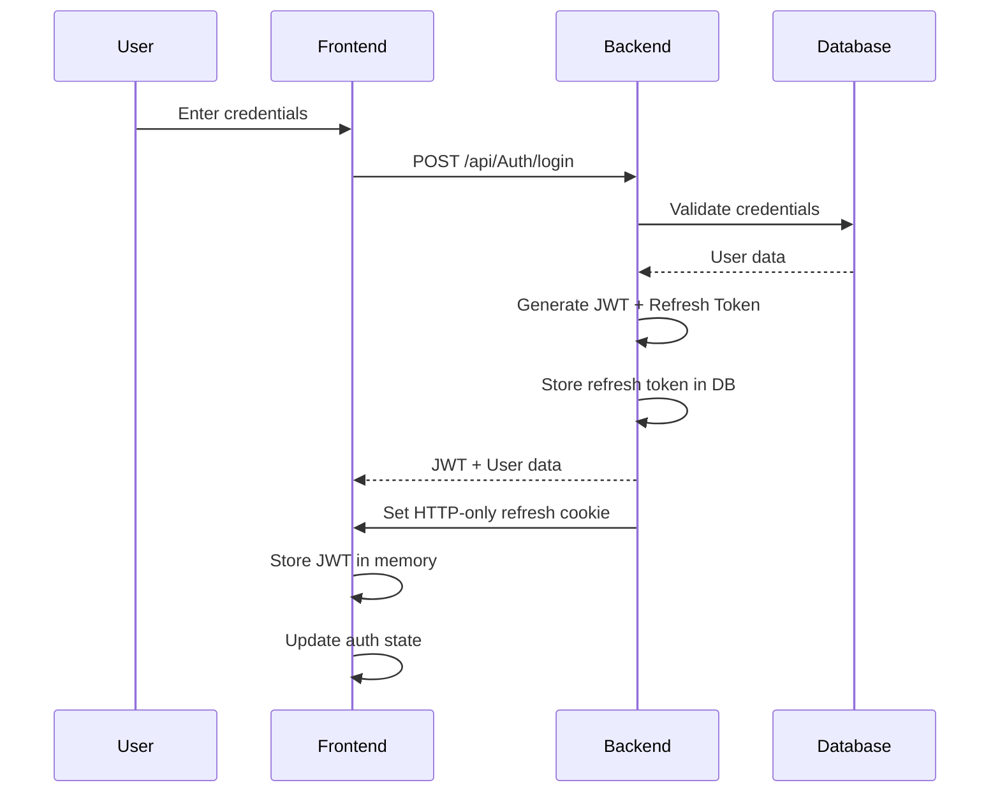
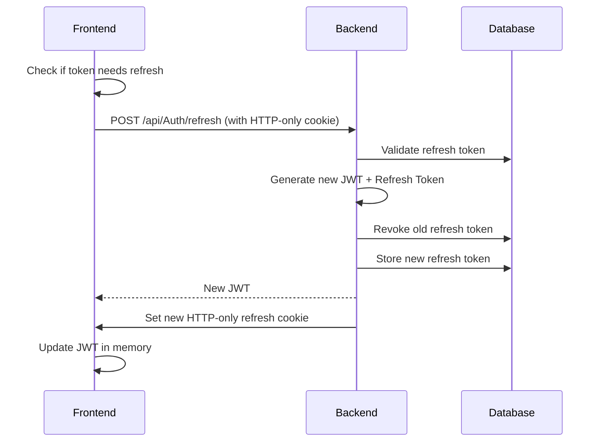
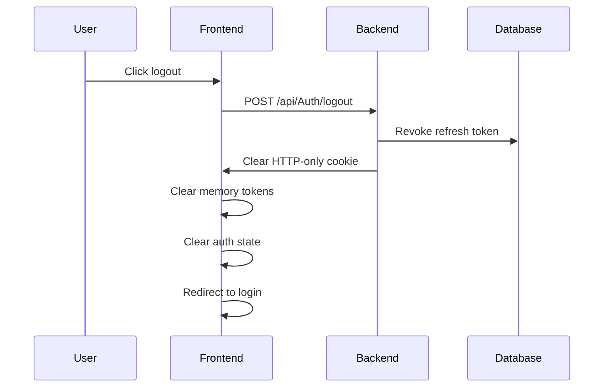

# PaPerWork Frontend Application

## Overview

PaPerWork is a modern React-based therapy management application built with TypeScript, Vite, and Tailwind CSS. This application follows industry best practices for authentication, state management, and user experience.

## 🏗️ Architecture Overview

### Technology Stack

- **Frontend Framework**: React 18 with TypeScript
- **Build Tool**: Vite (fast development and optimized builds)
- **Styling**: Tailwind CSS with custom components
- **State Management**: React Context API with custom hooks
- **HTTP Client**: Fetch API with custom service layer
- **Authentication**: JWT with HTTP-only cookies for refresh tokens
- **Backend**: .NET 8 Web API with CQRS pattern

### Project Structure

```
client/
├── src/
│   ├── app/                    # Application configuration and routing
│   ├── components/             # Reusable UI components
│   ├── features/               # Feature-based modules
│   │   ├── auth/              # Authentication feature
│   │   ├── patients/          # Patient management
│   │   ├── sessions/          # Therapy sessions
│   │   └── certifications/    # Certification management
│   ├── shared/                # Shared utilities and components
│   ├── services/              # API services and clients
│   ├── hooks/                 # Custom React hooks
│   ├── context/               # React contexts
│   └── types/                 # TypeScript type definitions
├── public/                    # Static assets
└── package.json
```

## 🔐 Authentication System

### Overview

The authentication system implements industry-standard security practices using JWT (JSON Web Tokens) with a dual-token approach:

- **Access Token**: Short-lived (60 minutes) JWT stored in memory
- **Refresh Token**: Long-lived (7 days) stored in HTTP-only cookies

### Why This Architecture?

This approach provides several security benefits:

1. **XSS Protection**: Access tokens in memory are not accessible to JavaScript
2. **CSRF Protection**: HTTP-only cookies prevent CSRF attacks
3. **Token Rotation**: Refresh tokens are rotated on each use
4. **Automatic Cleanup**: Tokens are automatically cleared on tab close

### Authentication Flow

#### 1. Login Process



#### 2. Token Refresh Process



#### 3. Logout Process



### Security Features

#### 1. Token Management

**Access Token (JWT)**:

- Stored in memory only (never persisted)
- 60-minute expiration
- Contains user claims (ID, email, role, etc.)
- Automatically refreshed before expiration

**Refresh Token**:

- Stored in HTTP-only cookie
- 7-day expiration
- Rotated on each refresh
- Revoked on logout or security events

#### 2. Session Security

- **Multi-tab Detection**: Prevents multiple concurrent sessions
- **Automatic Logout**: Clears session on tab close
- **Token Validation**: Validates tokens with backend on app load
- **Secure Storage**: No sensitive data in localStorage

#### 3. API Security

- **Automatic Token Attachment**: Tokens automatically added to requests
- **Token Refresh**: Seamless token refresh without user interaction
- **Error Handling**: Graceful handling of authentication failures

### Implementation Details

#### Frontend Authentication Context

```typescript
// AuthContext provides centralized authentication state
const AuthContext = createContext<AuthContextType | undefined>(undefined);

// Key features:
// - Token validation on app load
// - Automatic token refresh
// - Multi-tab session management
// - Secure token storage
```

#### Token Service

```typescript
class TokenService {
  // Memory-only token storage
  private accessToken: string | null = null;
  private tokenExpiry: number | null = null;

  // Automatic token refresh
  async getValidToken(): Promise<string | null> {
    // Handles token refresh automatically
  }
}
```

#### API Client

```typescript
class ApiClient {
  // Automatic token attachment
  async get<T>(endpoint: string): Promise<ApiResult<T>> {
    // Automatically includes JWT in Authorization header
  }
}
```

## 🏛️ Backend Architecture (CQRS Pattern)

### Overview

The backend implements the CQRS (Command Query Responsibility Segregation) pattern using MediatR, which provides several benefits:

1. **Separation of Concerns**: Commands and queries are handled separately
2. **Scalability**: Read and write operations can be scaled independently
3. **Maintainability**: Clear separation makes code easier to maintain
4. **Testability**: Each handler can be tested in isolation

### CQRS Implementation

#### Commands (Write Operations)

Commands represent actions that change the system state:

```csharp
// Base command class
public abstract class BaseCommand<TResponse> : IRequest<TResponse>
{
    public string? UserId { get; set; }
}

// Example: Login command
public class LoginCommand : BaseCommand<AuthResponse>
{
    public LoginRequest Request { get; set; } = null!;
}

// Command handler
public class LoginCommandHandler : IRequestHandler<LoginCommand, AuthResponse>
{
    public async Task<AuthResponse> Handle(LoginCommand request, CancellationToken cancellationToken)
    {
        // Handle login logic
    }
}
```

#### Queries (Read Operations)

Queries represent read-only operations:

```csharp
// Base query class
public abstract class BaseQuery<TResponse> : IRequest<TResponse>
{
    public string? UserId { get; set; }
}

// Example: Get user query
public class GetUserByIdQuery : BaseQuery<UserDto>
{
    public string Id { get; set; } = null!;
}

// Query handler
public class GetUserByIdQueryHandler : IRequestHandler<GetUserByIdQuery, UserDto>
{
    public async Task<UserDto> Handle(GetUserByIdQuery request, CancellationToken cancellationToken)
    {
        // Handle query logic
    }
}
```

### Why CQRS?

1. **Performance**: Read and write operations can be optimized separately
2. **Scalability**: Can use different databases for reads and writes
3. **Maintainability**: Clear separation of concerns
4. **Flexibility**: Easy to add new features without affecting existing code

### AutoMapper Integration

AutoMapper is used for object-to-object mapping, providing several benefits:

1. **Reduced Boilerplate**: Eliminates manual mapping code
2. **Type Safety**: Compile-time checking of mappings
3. **Maintainability**: Centralized mapping configuration
4. **Performance**: Optimized mapping with caching

#### Mapping Profiles

```csharp
public class UserMappingProfile : Profile
{
    public UserMappingProfile()
    {
        // Request to Entity mapping
        CreateMap<RegisterRequest, User>()
            .ForMember(dest => dest.Id, opt => opt.Ignore())
            .ForMember(dest => dest.PasswordHash, opt => opt.Ignore())
            // ... other ignored properties

        // Entity to Response mapping
        CreateMap<User, UserDto>()
            .ForMember(dest => dest.Name, opt => opt.MapFrom(src => $"{src.FirstName} {src.LastName}"));
    }
}
```

## 🔧 Development Setup

### Prerequisites

- Node.js 18+
- npm or yarn
- .NET 8 SDK (for backend)

### Installation

```bash
# Install dependencies
npm install

# Start development server
npm run dev

# Build for production
npm run build

# Preview production build
npm run preview
```

### Environment Configuration

Create a `.env.local` file:

```env
VITE_API_BASE_URL=https://localhost:7209/api
VITE_APP_NAME=PaPerWork
```

## 🚀 Key Features

### 1. Responsive Design

- Mobile-first approach
- Tailwind CSS for consistent styling
- Custom components for complex UI elements

### 2. State Management

- React Context for global state
- Custom hooks for reusable logic
- Optimized re-renders with useCallback and useMemo

### 3. Performance Optimization

- Code splitting with dynamic imports
- Lazy loading of components
- Optimized bundle size with Vite

### 4. Type Safety

- Full TypeScript implementation
- Strict type checking
- Comprehensive type definitions

## 📚 Learning Resources

### Authentication Best Practices

1. **OWASP Authentication Cheat Sheet**: https://cheatsheetseries.owasp.org/cheatsheets/Authentication_Cheat_Sheet.html
2. **JWT Best Practices**: https://tools.ietf.org/html/rfc8725
3. **HTTP-Only Cookies**: https://owasp.org/www-community/HttpOnly

### CQRS Pattern

1. **Microsoft CQRS Documentation**: https://docs.microsoft.com/en-us/azure/architecture/patterns/cqrs
2. **MediatR Library**: https://github.com/jbogard/MediatR
3. **CQRS with MediatR**: https://code-maze.com/cqrs-mediatr-in-aspnet-core/

### React Best Practices

1. **React Documentation**: https://react.dev/
2. **TypeScript with React**: https://react-typescript-cheatsheet.netlify.app/
3. **Vite Documentation**: https://vitejs.dev/

## 🔍 Next Steps for Learning

Based on the current implementation, here are the key areas to focus on next:

### 1. **Database Design and Entity Framework**

- Understand how entities are designed
- Learn about migrations and database relationships
- Study the DbContext configuration

### 2. **API Design and RESTful Principles**

- Learn about REST API design patterns
- Understand HTTP status codes and error handling
- Study API versioning and documentation

### 3. **Security Implementation**

- Deep dive into JWT token validation
- Learn about password hashing and salting
- Understand CORS and security headers

### 4. **Testing Strategies**

- Unit testing with xUnit (backend)
- Integration testing
- Frontend testing with React Testing Library

### 5. **Deployment and DevOps**

- Learn about Azure deployment
- Understand CI/CD pipelines
- Study monitoring and logging

## 🤝 Contributing

1. Follow the established code patterns
2. Use TypeScript for all new code
3. Write meaningful commit messages
4. Test your changes thoroughly
5. Update documentation as needed

## 📄 License

This project is for educational purposes and learning best practices in modern web development.
